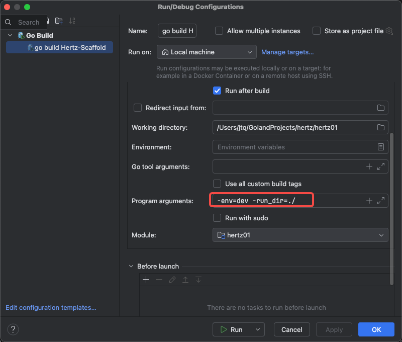

## 为什么想写一个

字节搞了个开源的Hertz框架，然后公司的业务分层也是值得学习的。

日常中使用的是Gin框架，不过现在习惯了公司的思路就想着用开源的搭建个脚手架。

我按照gin_scaffold的思路用Hertz改了个脚手架，从Gin过来的成本很低。

本框架能实现Http相关的业务上的『快速开始』。

## 如何快速开始
> 前置条件：已经配置好了Git与Go相关环境
 
在Goland中，在main.go文件下点击 ▶ 符号

第一次会提醒你缺少参数，然后右上角点击配置编辑

在程序实参的地方填入 -env="dev" -run_dir="." 即可


## 文件结构

```
├─biz # business
│  ├─bo # Object
│  ├─constant # 定义
│  ├─dal # 查询
│  ├─handler # 接口定义
│  ├─middleware # 中间件 
│  ├─model # 模型
│  ├─repository # 数据库
│  ├─service # 业务逻辑
│  ├─utils # 仓库
│  └─validate # 验证器
├─conf # 配置文件
└─cron_job # 定时任务
```

## 实现功能

1. 中间件注入，分引擎再定制化中间件，方法前还可以自定义前置方法
2. Binding的自定义校验Validator
3. Success与Error返回的统一格式
4. Logger的追踪与全局的实现
5. 配置文件的读取以及运用
6. 常用工具封装
7. 测试环境Init直接开写
8. Service、dal、model的常用Common

## Github工作流部署

工作流文件我已经写在了main.yml中了 说一下怎么配置
1. REMOTE_HOST 你的服务器IP
2. REMOTE_PORT 一般为22 ssh登陆
3. REMOTE_USER ssh登陆用户名
4. REMOTE_PASSWORD ssh登陆密码
5. REMOTE_PATH 你要放在服务器的文件路径 如/home/ubuntu/output/
6. STEP1: xxx_bin为你的编译后的名称
   ```bash
    if  [ -d  "/home/ubuntu/output/"  ]; then
    rm -r /home/ubuntu/output
    else
    echo  "文件夹不存在"
    fi
    pid=`ps -ef | grep xxx_bin | grep -v grep | awk '{print $2}'`
    kill -9 $pid
    ```
7. STEP2:
   ```bash
   cd /home/ubuntu/output && ./bootstrap_boe.sh
   ```

## idea启动 




## 相关链接

- Hertz官方文档：https://www.cloudwego.io/zh/docs/hertz/
- Gin脚手架：https://github.com/e421083458/gin_scaffold
